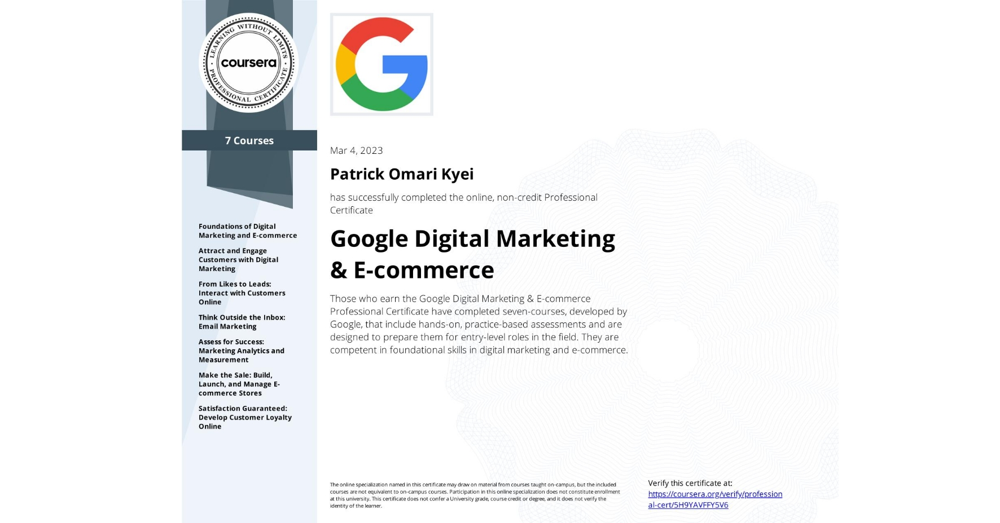

#Google Digital Marketing and E-commerce Module

 

- This repository is written for reference and self-documentation purposes

- Feeel free to contribute

## About this Professional Certificate

 

Prepare for a new career in the high-growth fields of digital marketing and e-commerce, in under six months, no experience or degree required. Businesses need digital marketing and e-commerce talent more than ever before; [86% of business leaders](https://www.gartner.com/en/marketing/research/state-of-digital-commerce-sem-digcomm?utm_source=google&utm_medium=cpc&utm_campaign=GML_NA_2021_GML_CPC_LG1_ALWAYSON&utm_adgroup=130458827183&utm_term=growth%20in%20e%20commerce&ad=572772144918&matchtype=p&gclid=CjwKCAjwrqqSBhBbEiwAlQeqGlylXrxqpD1b5KwbKUdVkjnFH8T-gSoCT0KxgLloBORIsYegpy7CqRoCFRUQAvD_BwE) report that digital commerce will be the most important route to growth. There are 218,000 U.S. job openings in this growing field, with a median entry-level salary of $51,000.¹

Throughout this program, you will gain in-demand skills that prepare you for an entry-level job and learn how to use tools and platforms like Canva, Constant Contact, Google Ads, Google Analytics, Hootsuite, HubSpot, Mailchimp, Shopify, and Twitter. You will learn from subject-matter experts at Google and have a chance to build your own portfolio with projects like customer personas and social media calendars to show to potential employers. 

75% of Google Career Certificate graduates in the US report seeing a positive impact on their career within six months²

Check out all Google Career Certificates [here](https://www.coursera.org/google-career-certificates).

This program contains no confidential information. All Google Search features taught are publicly available, you can learn more in official Google Search [documentation](https://developers.google.com/search/docs).

¹US Burning Glass Labor Insight Report salary data (median with 0-5 years experience) and job opening data. Data for job roles relevant to featured programs (4/01/2021 - 3/31/22).

²Based on program graduate survey responses, United States, 2021 

## Applied Learning Project

This program includes over 190 hours of instruction and practice-based assessments, which simulate real-world digital marketing and e-commerce scenarios that are critical for success in the workplace. The content is highly interactive and developed by Google employees with experience in the field.

Skills you’ll gain will include: Developing digital marketing and e-commerce strategies; attracting and engaging customers through digital marketing channels like search and email; measuring marketing analytics and sharing insights; building e-commerce stores, analyzing e-commerce performance, and building customer loyalty.

Platforms and tools you will learn include: Canva, Constant Contact, Google Ads, Google Analytics, Hootsuite, HubSpot, Mailchimp, Shopify, and Twitter

Through a mix of videos, assessments, and hands-on activities, you’ll learn how to use popular tools and platforms required for an entry-level job. Learn concrete skills that top employers are hiring for right now.
